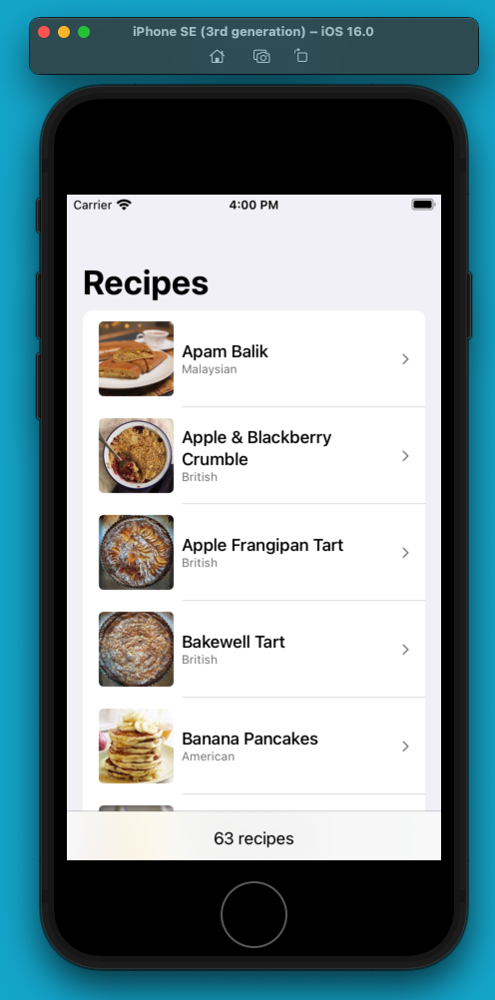
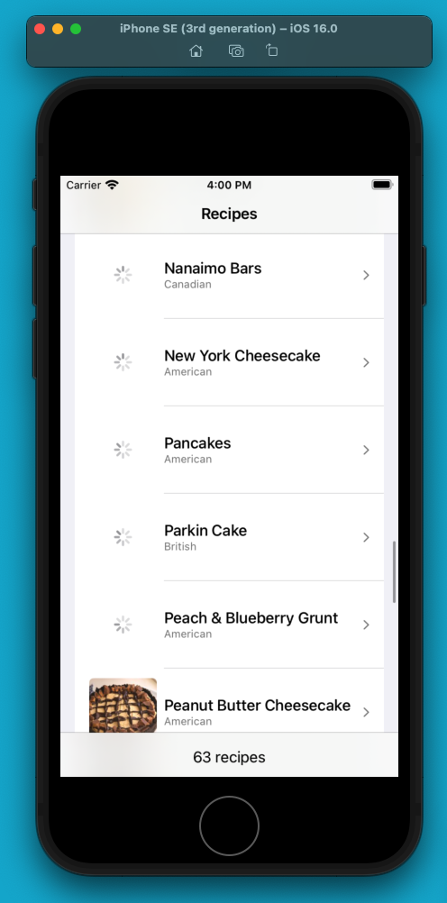
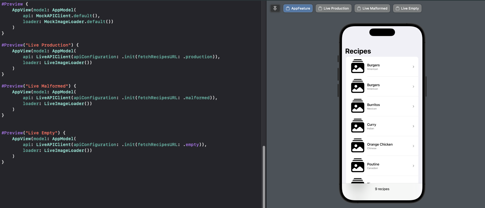

# FetchChallenge
 
### Summary: Include screen shots or a video of your app highlighting its features
Notes and folders can be added, searched, and persisted through the app.
App Feature

App Feature Previews with Mock + Test Data

### Focus Areas: What specific areas of the project did you prioritize? Why did you choose to focus on these areas?
I focused on making the project modular and test driven with iOS16+ and Swift6 support. This meant writing features in MVVM and setting up dependencies with protocol constructor-based injection, and adopting newer device and swift verions. The app has 90% test coverage.

I prioritized these for a couple reasons:
1. If Fetch is iOS16+, I'll support that system range
2. Swift 6 is optional, but guarantees the powerful new and safe Swift Concurrency tooling, reducing many potential and very dangerous bugs
3. MVVM allows encapsulated testable logic of features, to support test-driven development and a host of other benefits
4. Protocol Constructor-Based Dependency Injection allows the developer to write features with support for different dependency implementations, thus allowing features to run in SwiftUI previews, tests, or even choose their own implementation. An example in this project is the ability to run different previews in the app feature, which can load recipes form in-memory mock data, the production, malformed, or empty data versions of the provided recipes endpoint. The same applies to the app feature tests, where I test how the app handles the api fetching these different states of data. The image loading and cacheing feature tests are similar. Thanks to this system, I can develop features in isolation, control, and configure dependencies as I like allowing to focus on the work I am assigned.

### Time Spent: Approximately how long did you spend working on this project? How did you allocate your time?
I spent a couple hours to complete this project. I allocated my time by going through a several steps:
1. Looked over assignment documentation
2. Setup XCode with SwiftUI app target, XCTest test target, iOS16, and Swift 6
3. Wrote a recipe list UI with mock data (App Feature)
4. Refactored app feature to accept an api dependency via constructor and dynamically load and handle the data/errors
5. Wrote a mock api dependency then a live api dependency with an api configuration to support provided production, test API endpoints
6. Wrote unit tests for both the app feature and api dependency
7. Wrote a live and mock image load dependency for fetching images from a url and caches them to disk
8. Wrote unit tests for the image load dependency
9. Wrote a network image feature that uses the image load dependency
10. Integrated the network image feature into the app feature

### Trade-offs and Decisions: Did you make any significant trade-offs in your approach?
I think my approach to my time allocation and focus areas was really about setting up infrastructure to write modern testable modular SwiftUI features, which has a bit of boilerplate tradeoff. The benefit is one can change the dependencies right in their previews or test, sometimes including the actual endpoints themselves, leading to very flexible code. Another trade off I would say is adopting Swift 6. Swift 6 is hard to adapt, as it is pretty ruthless and not tolerant on concurrency saftey, but has a myriad of benefits. This code however, would compile in Swift 5 without any issues.

### Weakest Part of the Project: What do you think is the weakest part of your project?
I would have to say logging and coupling of the ImageLoading. It would very nice to log any api or image load errors instead of prints. The ImageLoad dependency, could struggle from scale, if the networking or caching part became more complicated. Right now it doesn't have any cache eviction policy, access is through an actor, which could be a performance bottleneck (serialized access). When scaling this, one could split the networking and or caching into two separate dependencies, which then the image loader could compose them.

### Additional Information: Is there anything else we should know? Feel free to share any insights or constraints you encountered.
I would love feedback and thoughts from other developers on how they would approach this challenge. What issues would they focus on? What experiences, challenges, or critical lessons have they faced that would be useful knowledge while solving this issue?
